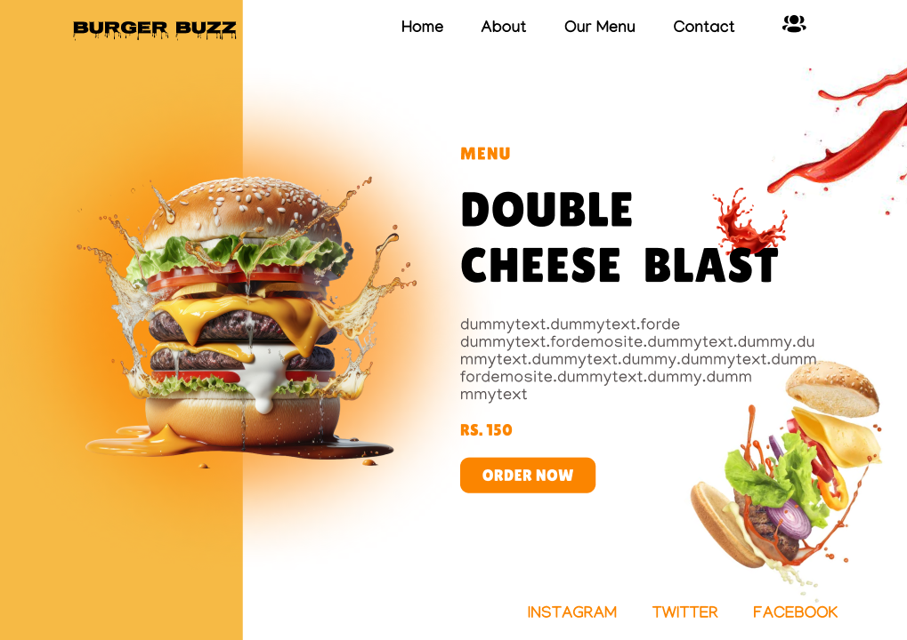

# Burger_Buzz_Figma_Design

**Overview**
- This Figma file presents the design for a captivating landing page aimed at enticing customers to indulge in delicious burgers. The design emphasizes vibrant colors, mouthwatering imagery, and clear call-to-action elements to create a compelling online presence for a burger shop.

**Design Tools**
* Figma

**Design Focus**
- The design emphasizes a visually appealing and appetizing look to entice customers to order burgers.

**Target Audience**
- The target audience for this landing page design includes [describe your target audience, e.g., young adults, families, or burger enthusiasts].

## Images

